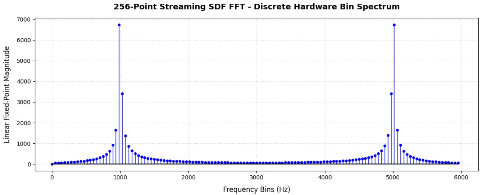
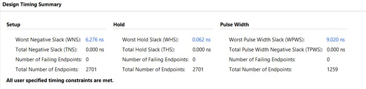
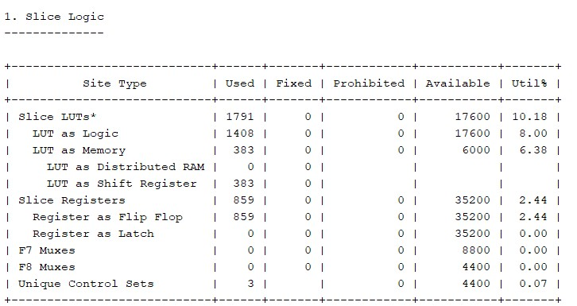
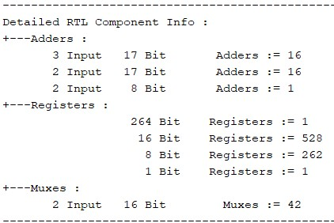
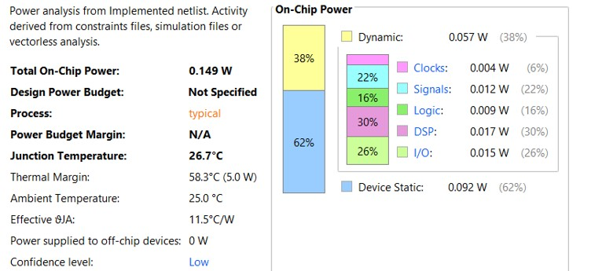
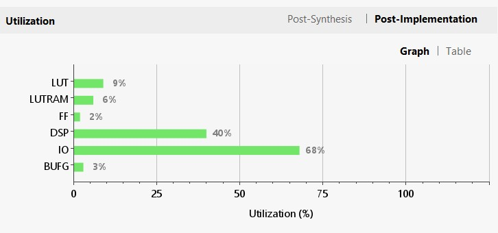
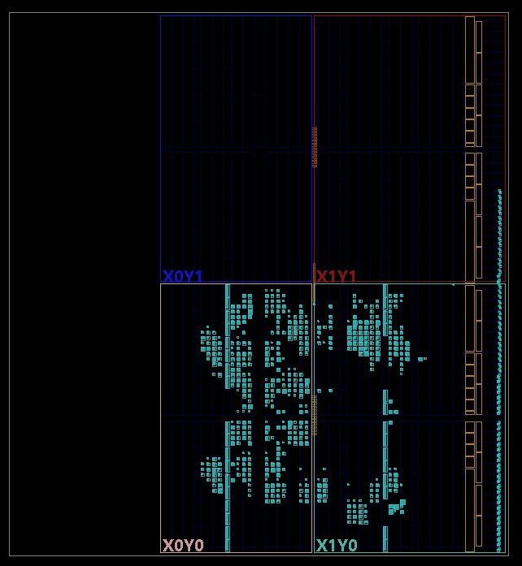

# Parameterized-256-Point-Streaming-FFT-Core

A highly scalable, pipelined **N-point Fast Fourier Transform (FFT)** processor designed in Verilog HDL. The architecture uses a **Single-path Delay Feedback (SDF)** streaming structure, making it ideal for real-time, high-throughput digital signal processing on FPGA hardware.

Data is processed continuously, one complex sample per clock cycle, with no block-buffering — samples flow through `log2(N)` cascaded radix-2 butterfly stages like a conveyor belt, closing timing cleanly and emitting a continuous stream of frequency bins. This repository's reference configuration instantiates a **256-point** FFT (`N = 256`, 8 stages).

Target device: **Xilinx Zynq-7000 (xc7z010clg400-1)**


## Core Technical Specifications

* **Default Transform Size:** 256-point 
* **Architecture Topology:** Radix-2 Single-path Delay Feedback (SDF) Pipeline
* **Arithmetic Precision:** 16-bit Signed Fixed-Point (**Q1.15 Format**: 1 Sign bit, 15 Fractional bits)
* **Pipeline Depth:** 8 stages
* **Data Interface:** 68-Port parallel streaming interface driven by a master system clock (`clk`)

---
## Architecture

Data samples stream through cascading processing blocks sequentially. Internal feedback shift registers dynamically shrink by half at every subsequent stage ($128 \rightarrow 64 \rightarrow 32 \dots \rightarrow 1$).

```text
                             +----------------------------------------+
                             |              STAGE (m)                 |
                             |                                        |
  Incoming Stream            |                  +----------------+    |
  Data (Real/Imag)           |                  | Shift Register |    |
  -------+-------------------+----------------->|  Delay Buffer  |    |
         |                   |                  | (Size = N/2^m) |    |
         |                   |                  +-------+--------+    |
         |                   |                          |             |
         |                   |                          | (x_buf)     |
         |                   |                          v             |
         |                   |                    /-----------/       |
         |                   |                   /   MUX A   /        |
         |                   |                  /-----------/         |
         |                   |                    |       |           |
         v                   |        [phase==0]  |       | [phase==1]|
  +--------------+           |        (Buffering) |       | (Compute) |
  |              |           |                    v       v           |
  |   Radix-2    |--(Sum)----+------------------->[0]     |           |
  |  Butterfly   |           |                    |       |           |
  |    Engine    |           |                    | MUX B |<----------+
  |              |--(Diff)---+------------------->[1]     |
  +------^-------+           |                    |       |
         |                   |                    +---+---+
         |                   |                        | 
         +-------------------|------------------------+ 
                             |                        | (Un-rotated out / Diff)
                             |                        v
                             |                +---------------+
                             |  +----------+  |    Complex    |    Outgoing Stream
                             |  | Twiddle  |->|  Multiplier   |---> Data
                             |  |   ROM    |  |  (Cross-Mult) |    (To Stage m+1)
                             |  +----------+  +---------------+
                             +----------------------------------------+
```
---
## Repository Structure

```
Parameterized-N-Point-Streaming-FFT-Core/
├── rtl/
│   ├── fft256_top.v                 # Top-level wrapper, stage cascade, counter alignment
│   ├── fft_sdf_stage.v              # Single radix-2 SDF butterfly stage
│   ├── twiddle_rom.v                # Twiddle-factor ROM (Q15, generated via Python)
│   ├── twiddles_re_hex.txt          # Twiddle ROM contents (real)
│   └── twiddles_im_hex.txt          # Twiddle ROM contents (imaginary)
├── sim/
│   ├── tb_fft256.v                  # Testbench
│   ├── input_stimulus.txt           # 256 time samples generated for 1kHz+5kHz sinusoidal input sampled at 12kHz via Python
│   └── output_results.txt           # Output file genrated by testbench
├── python/
│   ├── twiddle_generation.py        # Generates twiddle ROM hex files
│   ├── tb_input_generation.py       # Generates testbench input time samples
│   └── output_plot.py               # Plots frequency spectrum from output file generated by testbench
├── xdc/
│   └── fft256.xdc                   # Timing/pin constraints
├── bit/
│   └── fft256_top.bit               # Bit stream 
├── images/ 
│   ├── output.jpg                    
│   ├── layout.jpg                  
│   ├── slice.jpg
│   ├── power_thermal.jpg
│   ├── rtl_components.jpg
│   ├── timing.jpg
│   ├── utilisation.jpg        
└── README.md
```

## Simulation Results
Testbench stimulus: sinusoidal input of frequencies 1kHz and 5kHz sampled at **12 kHz**, fed sample-by-sample into `din_re` (with `din_im = 0`), verifying that the FFT output places energy in the expected bin.

- **256-point FFT, Fs = 12 kHz → bin resolution ≈ 46.875 Hz/bin**
- 1 kHz tone → expected peak near bin ⌊1000 / 46.875⌋ ≈ **bin 21**
- 5 kHz tone → expected peak near bin ⌊5000 / 46.875⌋ ≈ **bin 107**
#### Frequency Spectrum  


## Vivado Synthesis & Implementation Report
### 1. Target Device Profile
* **Product Family:** Zynq-7000
* **Device Part:** xc7z010clg400-1


### 2. Design Timing Summary
#### The design fully meets all user-specified timing constraints with comfortable safety margins and zero failing endpoints.




### 3. Hardware Resource Utilization

#### Slice Logic Metrics
<div align="left">
  
</div>

#### Elaborated RTL Component Info
<div align="left">
  
</div>


### 4. Power & Thermal Analysis

#### Power metrics extracted from the post-implementation netlist activity.



### 5. Sub-System Utilisation Breakdown


## Implementation Results (Silicon / FPGA Layout)

Target part: **xc7z010clg400-1 (Zynq-7000)**, `sys_clk` = 50 MHz (20 ns period).



*Post-implementation floorplan showing FFT butterfly/multiplier logic placed across the two SLR/clock-region quadrants (X0Y0–X1Y1) of the xc7z010.*

##  Hardware Compilation & Verification

The core has been fully synthesized and implemented with complete timing closure.

* **Target Hardware Device:** Digilent Nexys Video (`XC7A200T-1SBG484C`)
* **Generated Hardware Artifact:** `fft256_top.bit`
* **Port Verification Constraint Override:** Handled via `BITSTREAM.GENERAL.UNCONSTRAINEDPINS {Allow}` to accommodate floating parallel 64-bit wide streaming data nets on physical evaluation board targets.

##  Parametric Scaling Characteristics

The core features runtime parameter scaling (`parameter FFT_POINTS = 256`). Adjusting $N$ alters hardware footprints and timing metrics according to the constraints below:

| Architectural Metric | Impact of Scaling $N$ Up ($\uparrow$) | Impact of Scaling $N$ Down ($\downarrow$) |
| :--- | :--- | :--- |
| **Max Clock Frequency ($F_{\text{max}}$)** | **Decreases** (Higher routing complexity/fanout) | **Increases** (Tighter routing, higher slack) |
| **Memory Footprint (FFs/LUTs)** | **Increases Linearly** (Total delay memory = $N-1$ words) | **Decreases** (Saves massive FPGA fabric slices) |
| **Pipeline Latency** | **Increases** (Requires $N-1$ cycles before `out_valid`) | **Decreases** (Faster initial frame flushing) |
| **Hardware Stages** | **Increases** ($\log_2(N)$ layout calculation scale) | **Decreases** (Fewer structural modules needed) |
